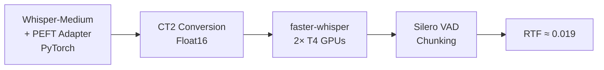

# Long-Form Bengali ASR — Team Villagers Solution Writeup
**DL Sprint 4.0 | BUET CSE FEST 2026**

[](https://arxiv.org/abs/2602.23070)
[](https://huggingface.co/datasets/teamvillagers/Lipi-Ghor-bn-882-SSTT)
[](https://huggingface.co/teamvillagers/whisper-bengali-ct2)
[](https://github.com/ahmfuad/villagers_training_notebooks)
[](https://github.com/Sanjidh090/DL_Sprint_4.0_Solution)

---

## Summary

Our ASR pipeline is built on Whisper-Medium fine-tuned for Bengali, further adapted with PEFT on a small but carefully corrupted subset of our Lipi-Ghor dataset, then converted to CTranslate2 for fast inference. Final competition WER was **~0.31** on the private leaderboard at an RTF of **~0.019**.

The short version of what we learned: with limited compute, data quality and augmentation strategy matter more than scale.

---

## Dataset Contribution: Lipi-Ghor

As part of this work, we release **Lipi-Ghor** — a large-scale Bengali speech dataset collected from YouTube via `yt-dlp`. Each entry contains an audio file paired with its transcript. Speaker boundaries were annotated using the Pyannote API and merged with word-level transcription alignments.

| Attribute | Value |
|---|---|
| Total Hours | 882h |
| Total Videos | 1,019 |
| Unique Channels | 596 |
| Domains | 150+ |
| Format | SSTT (Speech,speaker,text,timestamps) |

📦 [`teamvillagers/Lipi-Ghor-bn-882-SSTT`](https://huggingface.co/datasets/teamvillagers/Lipi-Ghor-bn-882-SSTT)

---

## Training Data

Due to compute constraints (Lightning AI L40S, 5 free hours/month), we could not train on the full Lipi-Ghor corpus. The actual training used two subsets:

- **Stage 1** — [`teamvillagers/Train_lighten_check_bangla`](https://huggingface.co/datasets/teamvillagers/Train_lighten_check_bangla): ~50h of clean Bengali audio used for the initial full fine-tune.
- **Stage 2** — `risalatlabib/bangla-audio-corrupted-30percent` (private): ~11.66h subset with 30% of audio synthetically corrupted before training (see Augmentation below).

---

## Model

The model went through two stages of fine-tuning:

**Stage 1 — Full fine-tune on 50 hours:**  
We fine-tuned Whisper-Medium on **50 hours** of Bengali audio ([`teamvillagers/Train_lighten_check_bangla`](https://huggingface.co/datasets/teamvillagers/Train_lighten_check_bangla)) on an L40S GPU (Lightning AI), producing [`teamvillagers/whisper-bengali-L40S-Final`](https://huggingface.co/teamvillagers/whisper-bengali-L40S-Final). This is the Bengali-adapted base.

**Stage 2 — PEFT adapter training on corrupted data:**  
We loaded the Stage 1 checkpoint in 8-bit (BitsAndBytes) and attached a pre-existing PEFT adapter (`fuadahm/tugstugi-adapter`), making only the adapter weights trainable. We then continued training on our ~11.66h corrupted subset. Only **~1.22% of parameters were trainable** (9.4M out of 773M).

```
Stage 1: Whisper-Medium → 50h Bengali fine-tune → hasans090/whisper-bengali-L40S-Final
Stage 2: Stage 1 + PEFT adapter → 11.66h corrupted fine-tune → teamvillagers/whisper-bengali-L40S-Final
Stage 3: CT2 conversion (Float16) → teamvillagers/whisper-bengali-ct2
Trainable params (Stage 2): 9,437,184 / 773,295,104 (1.22%)
```

### Training Config

| Parameter | Value |
|---|---|
| GPU | L40S 48GB (Lightning AI) |
| Steps | 1000 |
| Batch size | 16 |
| Learning rate | 1e-4 |
| Warmup steps | 100 |
| Precision | fp16 |
| Eval every | 300 steps |

Training took ~4 hours and converged cleanly:

| Step | Train Loss | Val Loss | Eval WER |
|---|---|---|---|
| 300 | 0.038 | 0.030 | 2.33% |
| 600 | 0.023 | 0.018 | 1.22% |
| 900 | 0.015 | 0.014 | 1.01% |

> Note: Eval WER here is on a 64-sample internal slice, not the competition test set.

---

## Augmentation

The key decision was corrupting 30% of the training audio **before** fine-tuning, using two effects applied via `pydub`:

**1. Hall Reverb** — simulates room acoustics by layering delayed, attenuated reflections through a low-pass filter at 1kHz.

**2. Random Frequency Drifting** — splits audio into 1-second chunks, randomly applies a "humming" effect (low-pass at 600Hz, –8dB) to 40% of chunks, and applies a 3kHz low-pass to the rest. Chunks are rejoined with a crossfade.

The idea: force the model to learn phonetic structure rather than clean-audio surface features. If 30% of what it sees is degraded, it can't rely on acoustic memorization.

```python
# Simplified version of the corruption pipeline
def add_hall_reverb(sound):
    delays = [60, 150, 250, 350]
    gains  = [-6, -10, -14, -18]
    final_mix = sound - 2
    for delay, gain in zip(delays, gains):
        reflection = low_pass_filter(sound + gain, 1000)
        final_mix = final_mix.overlay(reflection, position=delay)
    return final_mix
```

---

## Inference Pipeline

After training, the adapter was merged and the model was converted to **CTranslate2 (Float16)** for inference via `faster-whisper`. This dropped inference time from ~4 hours (native PyTorch Whisper on the 22-hour test set) to **~26 minutes** — roughly a 10× speedup.



**VAD note:** We used Silero VAD for chunking long-form audio. Pyannote VAD was tried but Silero was more reliable for our use case.

```python
from faster_whisper import WhisperModel

model = WhisperModel(
    "teamvillagers/whisper-bengali-ct2",
    device="cuda",
    compute_type="float16"
)

segments, _ = model.transcribe(
    "audio.wav",
    language="bn",
    vad_filter=True,
    vad_parameters={"min_silence_duration_ms": 500, "speech_pad_ms": 400}
)
```

---

## Results

| Model | RTF ↓ | Public WER ↓ | Private WER ↓ |
|---|---|---|---|
| Whisper-Medium (Tugstugi, baseline) | 0.182 | 0.444 | 0.451 |
| Titu-STT-BN-Conformer-Large (baseline) | 0.005 | 0.444 | 0.446 |
| FT Whisper-Med + Adapter (CT2) | 0.019 | 0.308 | 0.311 |
| FT Whisper-Med + Adapter + Demucs | 0.068 | 0.304 | 0.306 |

The Demucs row is worth a note: audio source separation before inference did improve WER slightly, but at the cost of RTF jumping from 0.019 → 0.068. Given that inference time was a scored metric, we dropped it from the final submission.

---

## What Didn't Work (Brief)

- **Contextual biasing** — helped early, degraded badly on OOD data past a training threshold
- **ROVER ensembling** — worse than individual models; errors were too correlated across our models to benefit from voting

---

## Limitations

The main bottleneck was compute, not methodology. Training on ~11.66 hours of a 882-hour dataset is a significant constraint. With more GPU hours and training on the full aligned subset of Lipi-Ghor, we believe WER sub-25% is achievable on this domain without any architectural changes.

---

## Reproducibility

| Resource | Link |
|---|---|
| Final inference model (CT2) | [`teamvillagers/whisper-bengali-ct2`](https://huggingface.co/teamvillagers/whisper-bengali-ct2) |
| Fine-tuned Whisper checkpoint | [`teamvillagers/whisper-bengali-L40S-Final`](https://huggingface.co/teamvillagers/whisper-bengali-L40S-Final) |
| Fine-tuned Titu-Conformer | [`teamvillagers/titu-stt-bn-conformer-large-finetuned`](https://huggingface.co/teamvillagers/titu-stt-bn-conformer-large-finetuned) |
| Full dataset | [`teamvillagers/Lipi-Ghor-bn-882-SSTT`](https://huggingface.co/datasets/teamvillagers/Lipi-Ghor-bn-882-SSTT) |
| Stage 1 training data (50h) | [`teamvillagers/Train_lighten_check_bangla`](https://huggingface.co/datasets/teamvillagers/Train_lighten_check_bangla) |
| Training data (corrupted subset) | `risalatlabib/bangla-audio-corrupted-30percent` (private) |
| Training notebooks | [`ahmfuad/villagers_training_notebooks`](https://github.com/ahmfuad/villagers_training_notebooks) |
| Full solution | [`Sanjidh090/DL_Sprint_4.0_Solution`](https://github.com/Sanjidh090/DL_Sprint_4.0_Solution) |

---

*Team Villagers — Sanjid Hasan, Risalat Labib, AHM Fuad, Bayazid Hasan*  
*DL Sprint 4.0, BUET CSE FEST 2026*
